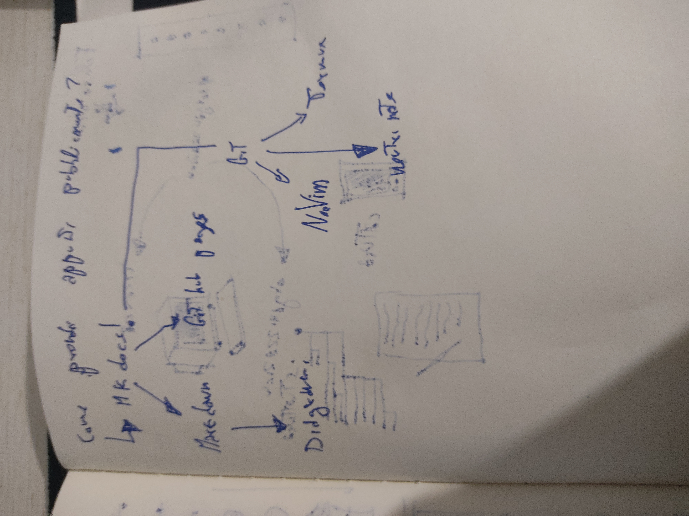

# Quali strumenti uso per gestire questo sito?

Pubblico gli appunti usando [GitHub Pages](https://pages.github.com/).

Per gestire e sincronizzare la cartella degli appunti (Chiamata repository) uso [Git](https://it.wikipedia.org/wiki/Git_(software)), un software che uso su tutti i miei dispositivi.

[MkDocs](https://www.mkdocs.org/), un generatore di siti web statici. Esso converte la cartella dei file degli appunti in un sito web!

I file testuali sono scritti in [Markdown](https://it.wikipedia.org/wiki/Markdown), un linguaggio testuale semplice, che mi permette di formattare facilmente i miei appunti con titoli, liste puntate, grassetto e italico.

Scrivo in markdown usando diversi editor di testo, ma quello che uso la maggior parte delle volte è [Neovim](https://neovim.io/), che mi consente di lavorare velocemente senza mouse.

Neovim è un software che uso su [Linux](https://www.linux.it/), perché tutti gli altri software citati sono principalmente disponibili per questo sistema operativo, e mi è quindi comodo avere tutto assieme.

Per questo ho installato [Termux](https://termux.dev/en/), un ambiente linux che mi permette di lavorare dal mio telefono Android!

Termux viene però sotto forma di terminale testuale, e non presenta quindi una componente grafica. Quando voglio lavorare più agevolmente dal telefono uso [neutriNote](https://github.com/appml/neutrinote), che mi consente di scattare ed inserire foto direttamente dall'app. 

