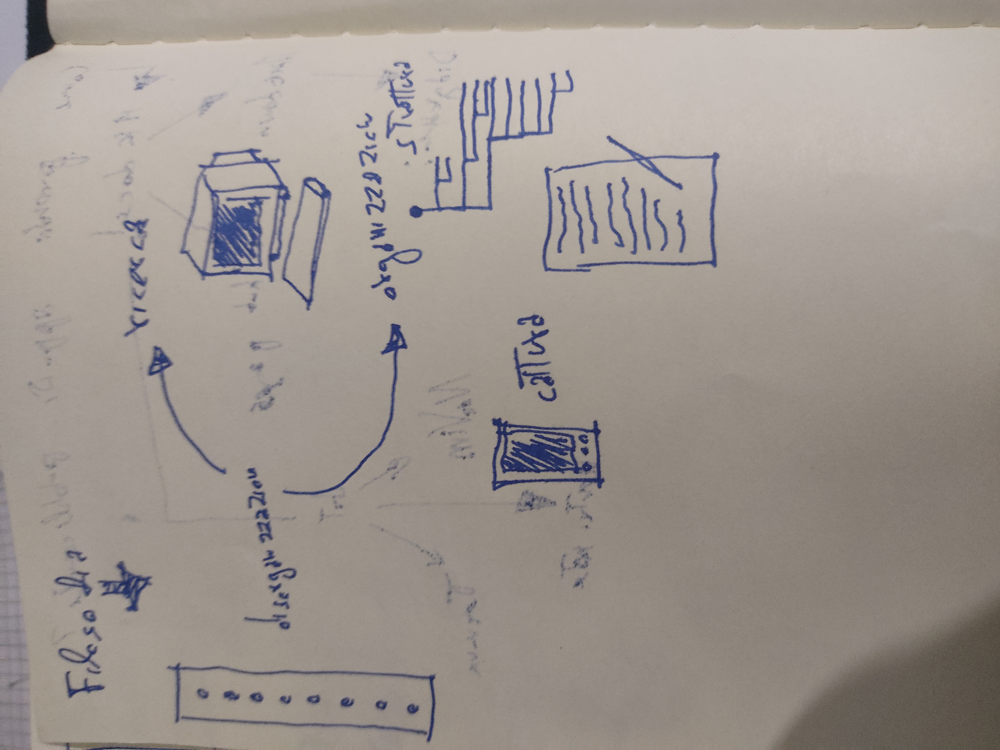

L'organizzazione del sito è quasi inesistente. Tutti i file sono dentro la stessa cartella. Ciò vuol dire non avere una gerarchia fra note. Non c'è un indice. La maggior parte delle note scritte fino ad ora sono solo accessibili tramite ricerca.

Alcuni prendono gli appunti su carta, altri in digitale, ma forse in pochi si sono ricordati che la potenza significativa dei computer è la capacità di calcolo. Essa ci consente di trovare immediatamente tutte le note che vogliamo cercare, senza passare per indici, quaderni in cassetti e scaffali!

In questo sito puoi trovare tutto quello che ho scritto e che vuoi trovare. Se non lo trovi non l'ho ancora scritto. Non credo che debba essere il sito a dirti cosa leggere ( Ancora non ho avuto così tanto orgoglio nei confronti di quei pochi appunti che scrivo).

Quando sarò orgoglioso a tal punto da fornire un indice dei contenuti guarderò gli appunti e li metterò in ordine. Non sarà l'ordine a dettare la forma degli appunti, ma sarà la forma degli appunti a dettare l'ordine.

Scrivo molto su carta e amo la tecnologia. Cerco di integrare i due aspetti facendo banalmente delle foto ai miei appunti cartacei (Quando  ne ho voglia) e inserendole negli appunti digitali.

Gli appunti che scrivo non presentano link diretti ad altri appunti che scrivo ma a delle ricerche che li riguardano. Rob, un tipo su internet, [ne parla molto qui](https://rwxrob.github.io/zet/610/). Per riassumere, ecco cosa succederebbe se usassi i link diretti:

- Gli appunti possono essere eliminati ed i link diretti smetterebbero di funzionare
- Gli appunti possono essere spostati ed i link diretti smetterebbero di funzionare
- Gli appunti possono essere rinominati ed i link diretti smetterebbero di funzionare
- I link diretti non permettono di fare riferimento a degli appunti che non esistono ancora (Un link ad una ricerca è sempre lo stesso, anche se la ricerca può dare risultati diversi nel tempo)

Questo sito è quindi vivo, dinamico, anche sono io che non me ne prendo abbastanza cura. La mia priorità va sempre al contenuto. **Prima viene il contenuto e poi viene l'ordine**, non il contrario.

